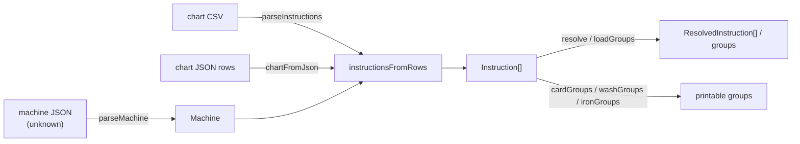

# Architecture

This package is a pure logic library: strings and parsed values in, values or
a thrown `Error` out. No file I/O, no network, no framework, no mutable state
that outlives a function call. `mixing.ts` is the one place with anything
resembling "domain logic at the centre" in the hexagonal sense, and even that
has no ports to speak of — there's nothing at the edge to adapt to, because
there is no edge. A consumer (the CLI, the web app, `@washy-washy/pdf`) owns
all of that: reading a file, rendering a PDF, persisting to storage.

## Directory layout

```text
src/
  types.ts     Instruction, ResolvedInstruction, ColourGroup, MixTag — the
               shared vocabulary every other module imports.
  machine.ts   parseMachine and friends. Validates a washer/iron description
               (programmes, temperatures, spins, iron thermostat positions)
               into a typed Machine.
  rows.ts      instructionsFromRows / rowsFromInstructions and the CSV<->JSON
               shared row shape (Row, COLUMNS). Validates a chart's rows
               against a Machine. chartFromJson/chartToJson are the JSON side.
  csv.ts       parseInstructions — the CSV-specific wrapper around
               instructionsFromRows. The only file that imports csv-parse,
               which is why it's excluded from browser.ts (see Gotchas below).
  config.ts    parseConfig/configFromJson/configToJson — a Machine and its
               chart validated together as one { machine, chart } object.
  mixing.ts    mixBlocker/canMix/resolve/loadGroups and the card/wash/iron
               grouping functions. Depends only on types.ts — no machine or
               row-parsing knowledge, since mixing rules apply to already-
               validated Instructions.
  index.ts     Barrel re-exporting everything, including csv.ts. Node/Bun
               entry point.
  browser.ts   Same barrel minus csv.ts. Browser bundle entry point.

test/          One *.test.ts per src module. Unit tests only — see
               CONTRIBUTING.md for why.
schema/        config.schema.json, generated from the Config type by
               `bun run schema` — never hand-edited.
scripts/       Build/tooling scripts (installing the pinned Vale binary),
               not part of the package's public surface.
styles/        Vale style packages (Google, proselint) and this repo's own
               vocabulary, fetched by `bun run prose:sync`.
.tools/        The pinned Vale binary itself, installed by scripts/.
```

## Data flow

Two independent things get validated, and one depends on the other: a chart's
rows are only meaningful in terms of what a specific machine can actually be
set to.



`parseConfig`/`configFromJson` run the same two steps as one call, over a
`{ machine, chart }` object — the chart is always checked against the machine
it arrived embedded with, never a different one passed in separately.

Everything downstream of `Instruction[]` (`mixing.ts`) only ever reads
already-validated data — it has no machine or parsing knowledge of its own,
which is why `browser.ts` can include it with no `Buffer` risk.

## Naming: camelCase in TypeScript, snake_case on the wire

`Instruction` fields are camelCase (`clothingType`, `fabricSoftener`). The CSV
header and the JSON row shape (`Row`, `COLUMNS` in `rows.ts`) are snake_case
(`clothing_type`, `fabric_softener`) — the CSV/JSON side is what a human edits
by hand or a spreadsheet exports, and snake_case is the convention the rest of
the chart format (and the generated JSON Schema) already uses.
`instructionsFromRows`/`rowsFromInstructions` are the only place that
translates between the two; nothing else needs to know both shapes exist.

## Coding standards

- **Biome** (`biome.json`) owns formatting and linting for every `.ts` file —
  double quotes, trailing commas, semicolons, 2-space indent, 100-column
  lines. `bun run lint:fix` applies it; the pre-commit hook already does, for
  staged files.
- **Every exported function and type carries a TSDoc comment with a runnable
  `@example`.** This is enforced by review, not by a linter — see the pull
  request checklist in [CONTRIBUTING.md](../CONTRIBUTING.md). It's also the
  source for [the generated API reference](https://alrayyes.github.io/washy-washy-core/)
  and your editor's hover.
- No comment that just restates the code. A TSDoc block earns its place by
  saying why a rule exists or what would go wrong without it — see any
  function in `mixing.ts` or `machine.ts` for the pattern.

Branching, commit format and the release process are in
[CONTRIBUTING.md](../CONTRIBUTING.md#workflow) — this file is scope, not
process.
